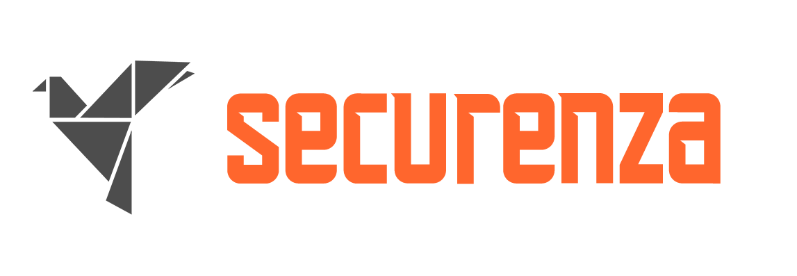

<h1 align="center">
 
SecurityFeed
</h1>

# RSS to Static Site with Newsboat

This repository uses [exaroth's github-runner-template](https://github.com/exaroth/github-runner-template) as a foundation to transform **Newsboat** RSS feed data into a **beautiful static website**. By leveraging GitHub Actions, the site is automatically generated and deployed every time new feed entries are found.

---

## License
SecurityFeed is provided under MIT License, see `LICENSE` file for details
